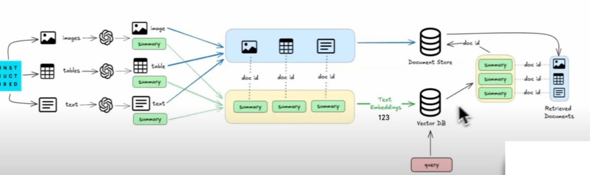

# 📄 Multi-modal RAG Pipeline with LangChain

**Tagline:** An advanced Retrieval-Augmented Generation (RAG) system for querying complex, multi-modal documents, integrating Text, Tables, and Images using LangChain.

### Project Overview

This repository features a robust implementation of a **Multi-modal Retrieval-Augmented Generation (RAG)** pipeline. Designed to move beyond traditional text-only data processing, this solution enables highly contextual and accurate question-answering over complex documents, such as PDFs containing varied content structures.

The core innovation lies in leveraging sophisticated document parsing to segment content into discrete, queryable elements—including text, structured tables, and embedded images—before vectorizing and storing them for retrieval.

**Diagram illustrating the multi-modal RAG workflow:**

---

